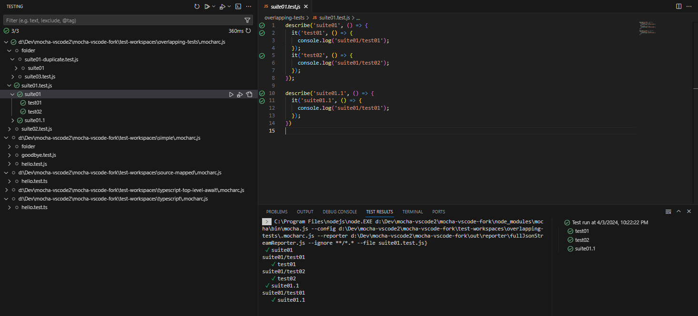
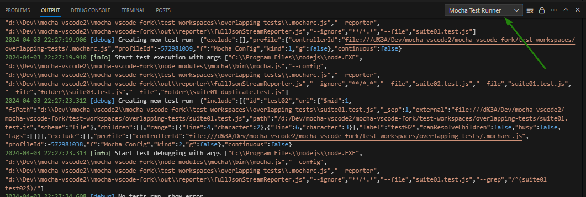
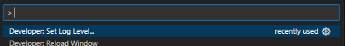

# Mocha VS Code Extension

This a community Visual Studio Code extension for enabling developers to run and debug [Mocha](https://mochajs.org/) tests right within VS Code using the built-in test explorer.

> [!NOTE]
> This extension is in a fairly early development stage but mostly functional. But watch out for any bugs 😉 
> 
> Please provide feedback and discuss improvements over at https://github.com/CoderLine/mocha-vscode/discussions and https://github.com/CoderLine/mocha-vscode/issues

## Getting Started

To get started follow the [general Mocha documentation](https://mochajs.org/) to set up testing for your project using the Mocha command line. Then, [install this extension](https://marketplace.visualstudio.com/items?itemName=coderline.mocha-vscode).

This extension automatically discovers and works with the `.mocharc.js/cjs/yaml/yml/json/jsonc` files found in your workspace. It requires minimal to no extra configuration. It works by looking at test files in your JavaScript and TypeScript code.

## Configuration

- `mocha-vscode.extractSettings`: Configures how tests get extracted. You can configure:

  - The `extractWith` mode, that specifies if tests are extracted.
    - `evaluation-cjs` (default) Translate the test file to CommonJS and evaluate it with all dependencies mocked.
    - `evaluation-cjs-full` Translate the test file to CommonJS and fully evaluate it with all dependencies.
    - `syntax` Parse the file and try to extract the tests from the syntax tree.
  - The `extractTimeout` limiting how long the extraction of tests for a single file is allowed to take.
  - The `test` and `suite` identifiers the process extracts. Defaults to `["it", "test"]` and `["describe", "suite"]` respectively, covering Mocha's common interfaces.

- `mocha-vscode.debugOptions`: options, normally found in the launch.json, to pass when debugging the extension. See [the docs](https://code.visualstudio.com/docs/nodejs/nodejs-debugging#_launch-configuration-attributes) for a complete list of options.

- `mocha-vscode.testEnvVariables`: environment variables that are passed when running tests. This is useful for setting things like `NODE_ENV`.

## Features

### Show, Running and Debugging Tests

This plugin integrates with the built-in test explorer and editor of VS Code to show, run and debug tests.

The extension detects `.mocharc.<extension>` configuration files in any folder or workspace you open and will use it to discover the tests to be run.

### TypeScript and ESM integration

This extension is designed to work with both TypeScript, JavaScript (CJS/ESM) codebases assuming you already have a working setup with Mocha and TypeScript integrated.

To discover tests this extension dynamically translates your TypeScript or ESM code to CommonJS code (via [ESBuild](https://esbuild.github.io/)) and executes it partially to build up the test list. If this execution fails or you are having code which cannot be translated to CommonJS (e.g. top level awaits) this will result in errors. 

For execution this extension will try to call directly the Mocha executable passing the `.mocharc` and additional arguments to it. 

## Troubleshooting

### Check if Mocha itself works

If you face any issues the first step should be to check whether your tests are working with Mocha itself (outside this extension). Use `npx mocha` in your working and test directories to see whether tests are found and executed successfully. In this case you might [reach out to the Mocha folks](https://github.com/mochajs/mocha/blob/master/.github/CONTRIBUTING.md) to ask questions or report bugs.

### Check the output window

This extension creates a new output log channel where we print whats happening behind the scenes. You can also increase the log level in VS Code via the `Developer: Set Log Level...` command.

## Credits

This project started as a fork of the `Extension Test Runner` and `Command-line runner for VS Code tests` developed by Microsoft and then was adapted to work with Mocha directly.
The main credits of this extension go over to the folks at Microsoft (and their contributors) and without them it would have been a lot more effort to ship a Mocha test runner for VS Code.

- https://marketplace.visualstudio.com/items?itemName=ms-vscode.extension-test-runner
- https://github.com/microsoft/vscode-extension-test-runner
- https://github.com/microsoft/vscode-test-cl
